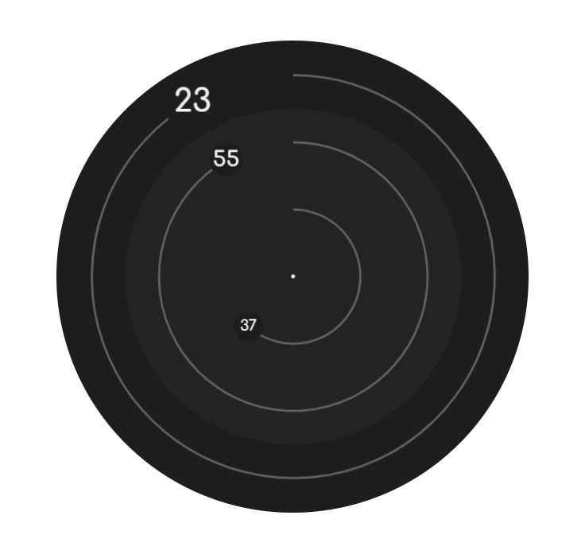
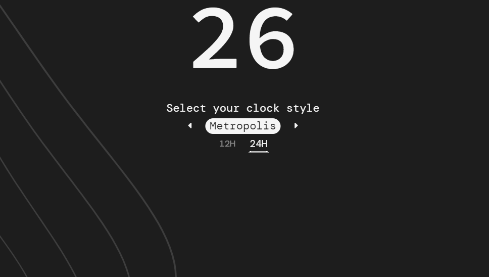

# Relaxing Clock 
[](https://app.netlify.com/sites/vigorous-murdock-a45fe2/deploys)

<p  align="center">
    
</p>

The sidecar of your working days, Relaxing Clock is an awesome web app you can keep opened in the background while concentrating. Login with **Spotify** and play your favourite lo-fi tracks, playlist and podcasts to study/relax to.

## Introducing the command box
<p align="center">
    
</p>

The new version of Relaxing Clock includes a new "command box" feature. It can be opened by pressing `Ctrl + Space` and unlocks lots of possibilities. Learn more about the usage of the command box [in the blog](https://blog.relaxingclock.com/posts/how_to_use_the_command_line/).

Missing something? Pressing `?` at any time will reveal a modal with all the available shortcuts/commands.

### Spotify integration
<p  align="center">
    
</p>

Your music can now be controlled from the command box: get started by typing `spotify:` and the type content you are looking for: it doesn't matter if want to fill your day with a relaxing `playlist` of listen to the latest `podcast` of your favourite content creator, Relaxing Clock has it all.

## Never forget something ever again
With the help of **repeated reminders 🔁** as well as **pinned messages 📍** your most important tasks are safe: empty your mind, I will ping you later!

## Some technical stuff

### Building 
This is a Svelte single-page-app: you will need NodeJS >12 as well as an `.env` file with the following variables:
```bash
SPOTIFY_CLIENT_ID="your_spotify_client_id" # Create one at https://developer.spotify.com/dashboard/applications
OW_APIKEY="your_openweathermaps_apikey"
SPOTIFY_REDIRECT_URL="spotify_redirect_url_for_this_client_id"
```

Then, just run:
```bash
npm install

cd app/
npm run dev
```
